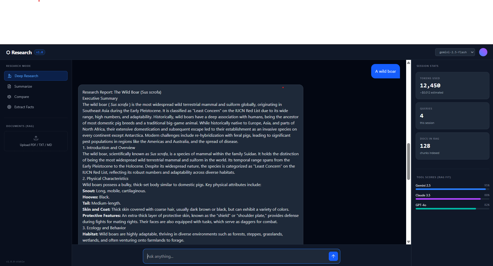
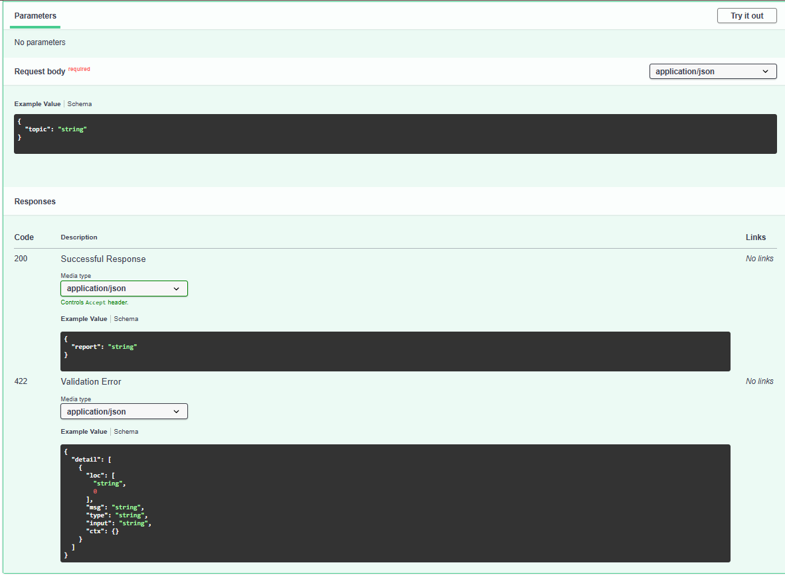
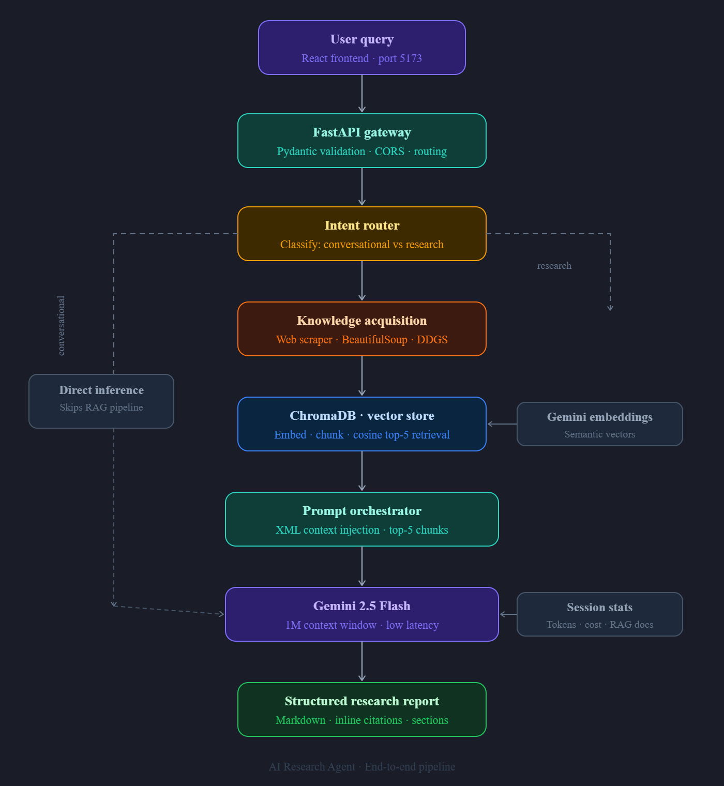

# 🚀 AI-Powered Business Research & Workflow Automation

[](https://www.python.org/)
[](https://fastapi.tiangolo.com/)
[](https://deepmind.google/technologies/gemini/)
[](https://opensource.org/licenses/MIT)

An enterprise-grade, asynchronous AI research agent built with a **Retrieval-Augmented Generation (RAG)** architecture. This system autonomously searches the web, ingests dynamic content, indexes data semantically, and synthesizes highly structured business reports.

---

## 🎬 Demo

[](https://www.loom.com/share/685e7590d82146eeabb574feefcc628b)

---

## 📸 Screenshots

### Research Interface

> Deep Research mode with live token tracking, cost estimation, and multi-model RAG scoring

### Backend API Docs

> Interactive Swagger UI at `http://localhost:8000/docs`

### Workflow Diagram

> End-to-end pipeline from user query to structured research report

---

## 📑 Table of Contents

1. [System Architecture](#-system-architecture)
2. [Quick Start Guide](#-quick-start-guide)
3. [AI Research & Evaluation](#-ai-research--evaluation)
4. [Tool Selection Reasoning](#-tool-selection-reasoning)
5. [Production Scaling Strategy](#-production-scaling-strategy)
6. [Unit Economics & TCO](#-unit-economics--tco)

---

## 🏗️ System Architecture

The prototype is decoupled into a high-performance, async-native backend API and a modular AI research agent, ensuring heavy I/O tasks do not block the main server thread.

### The Pipeline Flow

1. **API Gateway (FastAPI):** Receives typed requests and validates schemas via Pydantic.
2. **Intent Router:** Bypasses the heavy RAG pipeline for standard conversational queries to preserve API quotas.
3. **Knowledge Acquisition:** Dynamically scrapes target URLs and chunks text.
4. **Semantic Memory (ChromaDB):** Embeds chunks and retrieves the top-K most relevant snippets based on cosine similarity.
5. **Prompt Orchestrator:** Injects retrieved context and formatting instructions into an XML-tagged system prompt.
6. **Inference Engine (Gemini 2.5 Flash):** Generates the final structured markdown report with inline citations.

---

## ⚙️ Quick Start Guide

### Prerequisites

- **Python 3.10+**
- **Node.js (v18+) & npm**
- A valid **Google Gemini API Key**

### 1. Backend Setup (AI Engine)

Navigate to the root directory and configure the Python environment:

```bash
# Create and activate virtual environment
python -m venv venv
source venv/bin/activate  # On Windows use: venv\Scripts\activate

# Install core dependencies
pip install -r requirements.txt

# Configure Environment Variables
export GOOGLE_API_KEY="your_gemini_api_key_here"

# Boot the FastAPI Server
python main.py
```

> **Note:** The backend runs on `http://localhost:8000`. View the interactive Swagger API documentation at `http://localhost:8000/docs`.

### 2. Frontend Setup (Client UI)

Open a secondary terminal, navigate to the `frontend/` directory, and start the Vite development server:

```bash
cd frontend
npm install
npm run dev
```

> **Note:** The frontend runs on `http://localhost:5173`.

---

## 🔬 AI Research & Evaluation

To select the optimal technology stack, multiple Foundation Models (FMs) and orchestrators were evaluated based on **Context Window Depth**, **Unit Economics**, and **Inference Latency (TTFT)**.

| Feature | Google Gemini 2.5 Flash | OpenAI (GPT-4o) | CrewAI + Ollama |
|---|---|---|---|
| **Context Window** | 1M tokens | 128k tokens | Depends on local model |
| **Capabilities** | Massive context window, native multimodal, efficient RAG. | Best-in-class reasoning, highly standardized tool use. | Orchestration of multi-agent workflows, fully local. |
| **Pricing** | $0.15 / 1M input tokens | $2.50 / 1M input tokens | Free (Ollama), infra cost only |
| **Scalability** | Enterprise-grade, massive global infrastructure. | Industry standard, high availability. | High OpEx/CapEx; scaling requires custom GPU provisioning. |
| **Limitations** | Occasional hallucination on niche topics | Premium cost at scale | Latency and hardware dependent |
| **Verdict** | 🏆 **Selected for MVP** | Best for logic-heavy automation | Best for strict data sovereignty |

---

## 🛠️ Tool Selection Reasoning

- **Orchestration (FastAPI):** Selected over Flask/Django for its native `asyncio` support. Pydantic integration enforces strict payload validation (`min_length`), protecting upstream LLM APIs from malformed data.
- **Inference Engine (Gemini 2.5 Flash):** The 1M token context window allows the system to ingest unrefined web scrapes without complex summarization chains, drastically reducing Time-to-First-Token (TTFT). At $0.15/1M input tokens it is ~16x cheaper than GPT-4o for high-throughput research workloads.
- **Vector Storage (ChromaDB):** Selected for the prototype due to its zero-configuration local deployment. Allows rapid iteration of chunking strategies without cloud database costs during R&D.

---

## 🚀 Production Scaling Strategy

Deploying this system to a multi-tenant enterprise environment requires transitioning from a monolithic setup to a distributed microservices architecture:

- **Stateful Vector Migration:** Replace local ChromaDB with a managed cloud solution (Pinecone or pgvector) to support high-concurrency read/writes.
- **Asynchronous Task Queues:** Move the `run_research` method into a Celery worker + Redis queue. Web requests should return a `job_id`, allowing the UI to poll for completion rather than holding HTTP connections open.
- **Advanced Retrieval:** Upgrade from pure cosine similarity to a Hybrid Search model (BM25 Keyword + Vector Semantic) combined with a Cross-Encoder Re-ranker to maximize context precision.
- **Observability:** Implement tracing tools like LangSmith or Arize Phoenix to monitor embedding drift, token usage per user, and generation latency.

### Identified Risks & Mitigations

- **Network I/O Bottlenecks (`[WinError 10060]`):** LLM calls are susceptible to network timeouts. **Mitigation:** Implemented exponential backoff and retry logic in the generation wrapper.
- **Context Dilution:** Too many vector chunks cause the LLM to lose focus. **Mitigation:** Retrieval is strictly capped (`n_results=5`), using `<retrieved_context>` XML tags to create hard semantic boundaries.

---

## 💰 Unit Economics & TCO

Estimated monthly operational cost (OpEx) for **10,000 deep research reports/month** (assuming ~50k input tokens and ~1k output tokens per report).

| Infrastructure | Provider / Purpose | Est. Monthly Cost |
|---|---|---|
| Compute (API) | Google Gemini API (Inference & Embeddings) | ~$45.00 |
| App Hosting | AWS AppRunner / Render (Auto-scaling) | ~$25.00 |
| Vector Storage | Pinecone Serverless (~1M Vectors) | ~$30.00 |
| Data Extraction | Proxy Service / Serper.dev | ~$10.00 |
| **Total OpEx** | **End-to-end automated research** | **~$110.00 / month** |

> **Business Impact:** The system achieves an estimated cost of **~$0.011 per comprehensive research report**, representing a massive ROI compared to manual analyst labor.

---

*Architected and engineered by Ayush Jaiswal.*